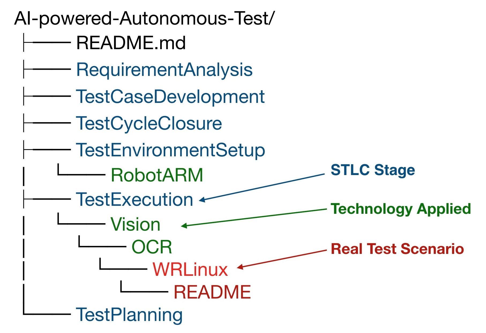

# AI-powered Autonomous Testing Platform

**Continuously embracing new technologies to achieve AI-driven the tests without human intervention**

## What is Autonomous Test?
Manual => Automation => Autonomy

“Completely Autonomous Test” means AI will fully control the whole STLC (Software Testing Life Cycle) and take responsible for each stage of testing.

## Value

- Low latency on defect finding
- Low cost
- 7 * 24 hour continuous working
- Find issues for human difficult to cover 
- Things robots do better than humans ([5-things-robots-better-humans/](https://www.therobotreport.com/5-things-robots-better-humans/))

## Mission
- *Stage 0. Without AI, the test automation rate has not been reached to 100% (Current)*
- Stage 1. AI-assisted testing with human intervention implement  100% automation
- Stage 2. AI analyze requirement, test plan and code generation with human guidance
- Stage 3. AI fully drive test itself without human supervision

## Architecture

